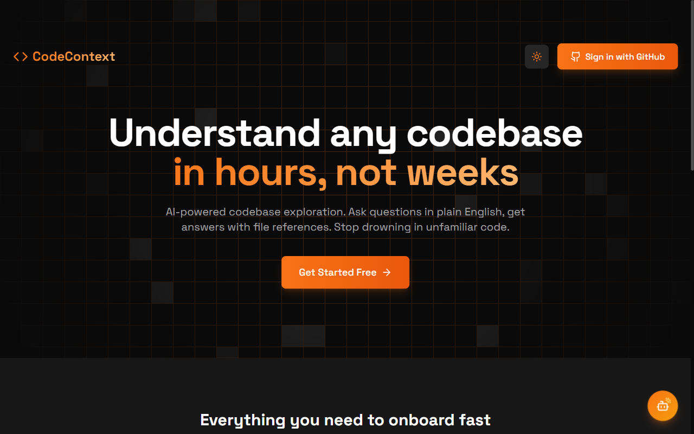
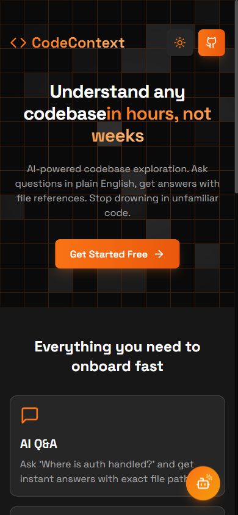

<div align="center">

# CodeContext

**Understand any codebase in hours, not weeks.**

[](https://www.codecontext.tech)
[](LICENSE)
[](https://www.typescriptlang.org/)
[](https://react.dev/)

AI-powered codebase exploration tool that helps developers onboard to new projects faster.





</div>

---

## Features

- **AI Q&A** — Ask questions like "Where is authentication handled?" and get instant answers with file references
- **Visual File Tree** — Interactive codebase explorer with AI-generated summaries
- **Architecture Detection** — Auto-detect frameworks, patterns, and structure
- **Powered by NVIDIA NIM** — Free AI APIs (Llama 3.1 70B)

## Tech Stack

| Layer | Technologies |
|-------|-------------|
| **Frontend** | React, TypeScript, Vite, Tailwind CSS |
| **Backend** | Node.js, Express, TypeScript |
| **Database** | Supabase (PostgreSQL) |
| **AI** | NVIDIA NIM (Llama 3.1 for chat, embeddings for search) |
| **Auth** | GitHub OAuth |
| **Hosting** | Render |

## Getting Started

### Prerequisites

- Node.js 18+
- Supabase account (free at [supabase.com](https://supabase.com))
- GitHub OAuth App
- NVIDIA NIM API Key (free at [build.nvidia.com](https://build.nvidia.com))

### Setup

1. **Clone and install dependencies:**

```bash
git clone https://github.com/thxgp/codecontext.git
cd codecontext
npm run install:all
```

2. **Configure environment variables:**

```bash
cp .env.example server/.env
```

Edit `server/.env` with your credentials:

```env
SUPABASE_URL=your_supabase_project_url
SUPABASE_ANON_KEY=your_supabase_anon_key
GITHUB_CLIENT_ID=your_github_client_id
GITHUB_CLIENT_SECRET=your_github_client_secret
NVIDIA_API_KEY=your_nvidia_api_key
JWT_SECRET=your_random_secret_key
```

3. **Create GitHub OAuth App:**

   - Go to GitHub Settings → Developer Settings → OAuth Apps
   - Create new app with:
     - Homepage URL: `http://localhost:5173`
     - Callback URL: `http://localhost:5000/api/auth/github/callback`

4. **Get NVIDIA NIM API Key:**

   - Sign up at [build.nvidia.com](https://build.nvidia.com)
   - Get free API key (1000 credits/month)

5. **Run the app:**

```bash
npm run dev
```

- Frontend: http://localhost:5173
- Backend: http://localhost:5000

## Project Structure

```
codecontext/
├── client/                 # React frontend
│   ├── src/
│   │   ├── components/     # UI components
│   │   ├── pages/          # Page components
│   │   ├── stores/         # Zustand state
│   │   ├── services/       # API calls
│   │   └── types/          # TypeScript types
│   └── ...
├── server/                 # Express backend
│   ├── src/
│   │   ├── config/         # Configuration
│   │   ├── models/         # Database models
│   │   ├── routes/         # API routes
│   │   ├── services/       # Business logic
│   │   └── middleware/     # Auth, error handling
│   ├── supabase/           # Database migrations
│   └── ...
└── ...
```

## API Endpoints

### Auth
- `GET /api/auth/github` — Initiate OAuth
- `GET /api/auth/me` — Get current user

### Repositories
- `GET /api/repos` — List imported repos
- `POST /api/repos` — Import new repo
- `GET /api/repos/:id` — Get repo details
- `GET /api/repos/:id/structure` — Get file tree
- `DELETE /api/repos/:id` — Delete repo

### AI
- `POST /api/ai/:repoId/ask` — Ask question about codebase
- `GET /api/ai/:repoId/search` — Search files
- `GET /api/ai/:repoId/chat` — Get chat history

## License

This project is licensed under the MIT License — see the [LICENSE](LICENSE) file for details.
